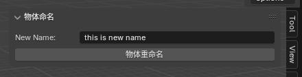

# BlenderAddon 最小开发框架

## 📖 项目简介

一个专为 Blender 插件开发初学者设计的极简开发框架，帮助零基础开发者快速入门 Blender 插件开发。

## ✨ 特性

- **极简结构**：清晰的模块化设计，易于理解和扩展
- **新手友好**：专为零基础开发者设计，学习曲线平缓
- **完整示例**：包含属性面板、功能函数、UI界面等完整示例

## 🛠️ 环境说明

- **操作系统**：Windows（推荐）
- **Blender 版本**：4.x（推荐使用 LTS 长期支持版本）。本框架最初开发版本为 4.27 LTS版本。
- **Python 版本**：Blender 内置 Python 3.x。Blender python 编译器和电脑全局 python 是两个隔离的环境。
- **代码编辑器**：Visual Studio Code（推荐）
- **开发辅助**：VSCode Extension `Blender Development(Jacques Lucke)`

## 🚀 快速开始

### 1. 获取代码

```bash
git clone https://github.com/yourusername/BlenderMiniAddon.git
cd BlenderMiniAddon
```

### 2. 配置开发环境

1. 在 VSCode 中打开项目文件夹，安装 VSCode Extension
    - Blender Development(Jacques Lucke)
    - python extension
2. （可选）推荐配置 Python 虚拟环境

### 3. BlenderAPI 自动补全

为了获得更好的开发体验，建议配置 Python 虚拟环境，同时安装相关依赖：

```
pip install -r requirements.txt
```

## 📁 项目结构

```
BlenderMiniAddon/
├── init.py             # 插件主文件，注册入口 
├── properties.py       # 属性定义模块
├── functions.py        # 功能函数模块 
├── ui.py               # 用户界面模块 
├── requirements.txt    # Python 依赖列表
└── imgs/               # 图片资源目录
```

## 🔧 开发指南

### 1. 模块说明

- **`__init__.py`**：插件注册入口，管理模块加载和卸载
- **`properties.py`**：定义插件的属性和数据存储
- **`functions.py`**：实现核心功能逻辑
- **`ui.py`**：创建用户界面面板和操作按钮

### 2. 调试技巧

使用 VSCode 的 Debug 模式进行调试，参考 [Blender + VSCode 调试环境搭建指南](https://blog.csdn.net/qq_44874004/article/details/130649228)

### 3. 插件重载

目前暂不支持热更新，需要手动重载插件：

在 VSCode 中按 `Ctrl+Shift+P`，执行 "Blender: Reload Addons"。插件将重新加载，应用最新修改。

## 🎯 使用示例

重载完成后，即可在 Blender 侧边栏找到新增的面板。



## 💡 学习建议

对于初学者，建议按照以下步骤学习：

- 先成功运行现有框架，理解基本结构
- 尝试添加新的功能面板、函数、扩展插件属性
- 3D 数据处理和操作
  - 掌握基本的 3D 操作（如创建、修改、删除 3D 物体等）
  - 学习 Blender 脚本编写（如创建自定义操作、批量处理等）
- 集成第三方 Python 库
  - <ins>Blender python 编译器和电脑全局 python 是两个隔离的环境。安装包时需要注意。</ins>
- 掌握断点调试技巧
- 参考 Blender 官方文档深入了解更多 API

在调用 Blender API 时，快速获取 Python 功能调用信息是非常重要的。以下是一些建议：

- 快速获取 Python 功能调用
    - Edit - Interface - python tooltips 开关。鼠标悬停在函数或属性上，即可显示 python 调用信息
    - 执行目标动作，查看 Blender Info 窗口代码表示

## 📚 学习资源

- [Blender Python API 文档](https://docs.blender.org/api/current/)
- [BlenderAddonPackageTool](https://github.com/xzhuah/BlenderAddonPackageTool)：A framework for developing multiple blender addons in one project.

## 🤝 贡献指南

欢迎提交 Issue 和 Pull Request 来改进这个框架！

如果你觉得这个项目对你有帮助，请给个 ⭐ 支持一下！

Happy Coding! 🎉
